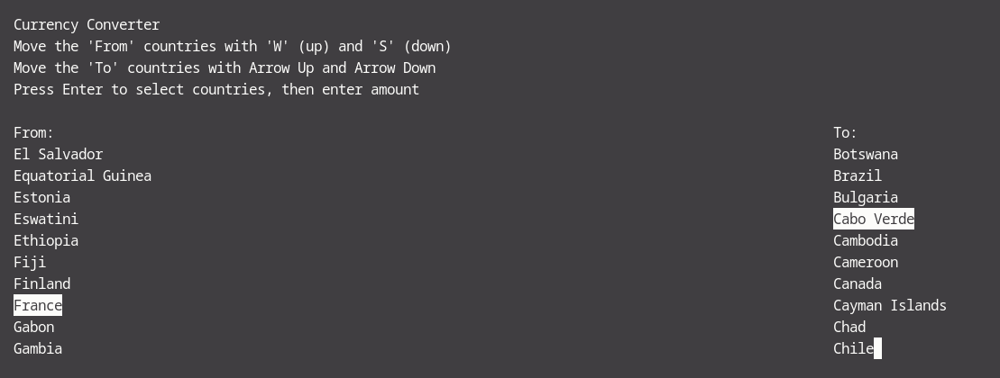
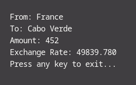

# Currency Converter CLI in C

This project is a CLI that allows you to convert currencies.

- Created a small server to fetch exchange rates.
- Made UI to present the countries and exchange rates.
- Made this project for learning purposes in C.

## Project Structure

- `convert.sh`: Script that runs the project.
- `server.c`: Server that fetches exchange rates.
- `ui.c`: UI that presents the countries and exchange rates.
- `countries.c`: List of countries and their codes.

## How to use it

Run the following command:

```bash
./convert.sh
```

Follow the instructions on the screen (see images).

## Images





## Sources

[Rates By Exchange Rate API](https://www.exchangerate-api.com)
